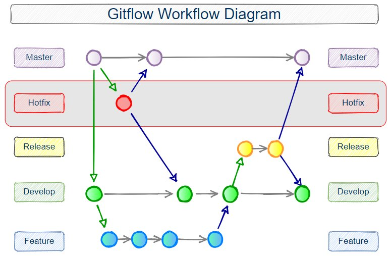

## Introduction

As the core mosaik team, we are always very happy about anyone who wants to work with or on mosaik. Since you are reading this guide, you might be one of these people, so here are some pointers.

Contributions to mosaik can take many forms:

- You might be a user of mosaik and write about your work. If you do, let us know! We are generally very happy to link to papers using mosaik on [our webpage](https://mosaik.offis.de/publications/). 
- You might be someone who publishes their own mosaik simulators. Again, we are happy to refer others to your work on our [ReadtheDocs](https://mosaik.readthedocs.io/en/latest/ecosystem/index.html).
- You might have an idea for a new feature, have a question or have found a bug. Feel welcome to [create an issue on GitLab](https://gitlab.com/mosaik/mosaik/-/issues) so that we can discuss your topic.
- You might be interested in contributing to mosaik or the simulators that we provide directly. If so, read on!

## Project structure

The project structure is explained in detail in the [ecosystem part of our ReadtheDocs](https://mosaik.readthedocs.io/en/latest/ecosystem/index.html)

mosaik consists of a bunch of packages, mostly published on PyPI (except for non-Python packages). You are welcome to contribute to any of them.

### mosaik Core

The package simply called *mosaik* contains mosaik’s core consisting of the scenario API (which is used to set up scenarios) and the scheduler (which runs them). It has the most up-to-date version of the Python mosaik API as a dependency to reuse the types and network code contained within it.

### mosaik API

The *mosaik-api-v3* package contains the base class to implement new simulators for mosaik (the so-called *mosaik API*) in Python. As such it also contains the basic types describing mosaik simulators and the shared networking code.

**Why the “v3”?** This will enable us to publish further versions of the mosaik API that can be installed in parallel to the previous versions of the API. This means that users won’t need to update all their simulators right away. Major version numbers should coincide with mosaik versions.

### Simulators

Each simulator (or set of related simulators) is published as a separate package, so that user’s don’t need to install dependencies for simulators that they don’t use. You are of course free to develop your own simulators however you like, though we would kindly ask you to follow the bold sentence in the following paragraph.

All mosaik simulators written by the mosaik team should be placed under the `mosaik_components` namespace. For each component, there should be a subpackage of that component’s name which contains the simulator class simply named `Simulator`. This will allow users to use them in mosaik by specifying `mosaik_components.component_name:Simulator`, which reads nicely. If a component provides several simulators (such as a reader and a writer), appropriate names instead of `Simulator` can be used. **Simulators not maintained by the mosaik team should not be placed in the `mosaik_components` namespace.** Also, currently, quite a few existing mosaik simulators are placed in other namespaces for legacy reasons.

### mosaik-api-java, mosaik-api-csharp, …

These are implementations of the low-level mosaik API in the named programming languages to make it easier to write mosaik simulators in those languages.

## Coding Conventions

### Formatting

New or reworked code added to mosaik and its components should follow the [black style](https://black.readthedocs.io/en/stable/the_black_code_style/index.html). However, existing code should not be updated to this style unless edited for other reasons. (This is to avoid commits showing diffs of code that has not actually changed.) *In particular, this means that you currently cannot simply run `black` on mosaik code to transform it into the right style.* You will have to do it “by hand”, which mostly boils down to following [PEP8 guidelines](https://peps.python.org/pep-0008/), with the exception that lines may be up to 88 characters long. Lines containing docstrings or only comments should still be wrapped at 72 characters. Instead of formatting by hand, you can also run `black` on the relevant file and then only commit those lines that actually contain new code.

### Comments

API documentation is done docstrings, following [sphinx conventions](https://sphinx-rtd-tutorial.readthedocs.io/en/latest/docstrings.html).

```
    def example_function(a: int) -> int:
        """This function does nothing.

        :param a: Example variable
        :type a: int
        ...
        :return: the parameter ``a``
        :rtype: int
        """
        return a

```

## Naming Conventions

“mosaik” should always be rendered in lower case.

Simulators should name their entities in the style `ModelName-0` where `ModelName` is the name of the model created and `0` is an unique index for that model (if necessary). If there are good reasons, other names may be chosen. For better interoperability, it is advisable to stick to ASCII letters and numbers, `_`, and `-` when choosing entity names.

For al other naming conventions, we follow the [PEP8](https://peps.python.org/pep-0008/#naming-conventions) guidelines.

## Testing
Currently, we test mosaik and mosaik simulators with example scenarios with known outcome. You can find them [here](https://gitlab.com/mosaik/mosaik/-/tree/develop/tests). Nevertheless, this testing strategy is far from perfect.


## Development
This part describes the workflow we use when publishing mosaik code.



Figure: Overview of git worklfow [1](https://www.theserverside.com/blog/Coffee-Talk-Java-News-Stories-and-Opinions/init-Gitflow-example-workflow-tutorial)

The above figure shows the git workflow we are using currently.

A new feature, as well as bug fixes, should be developed on a new branch that is created from develop. It should be merged back into the develop branch when finished.

If you want to contribute, the first step is a new issue in our mosaik GitLab. There, we can discuss your idea and solution and see if it would be a good fit for mosaik. Please check for a similar issue before opening a new one in GitLab.

If you want to contribute code, you can fork the project, create a new branch and work on your code. Once you are finished, create a merge request in our repository. We'll check and discuss your contribution before merging.

New mosaik releases are done periodically by the mosaik team. It can possibly take a while until new code is released.

## :rocket: Working together 
To achieve an environment where people work together harmoniously please follow common decency and be respectful when talking with fellow developers.


